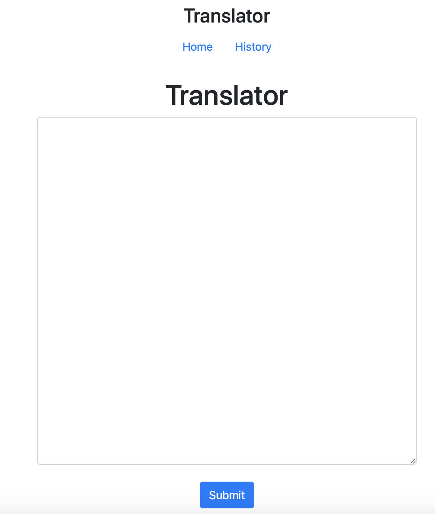
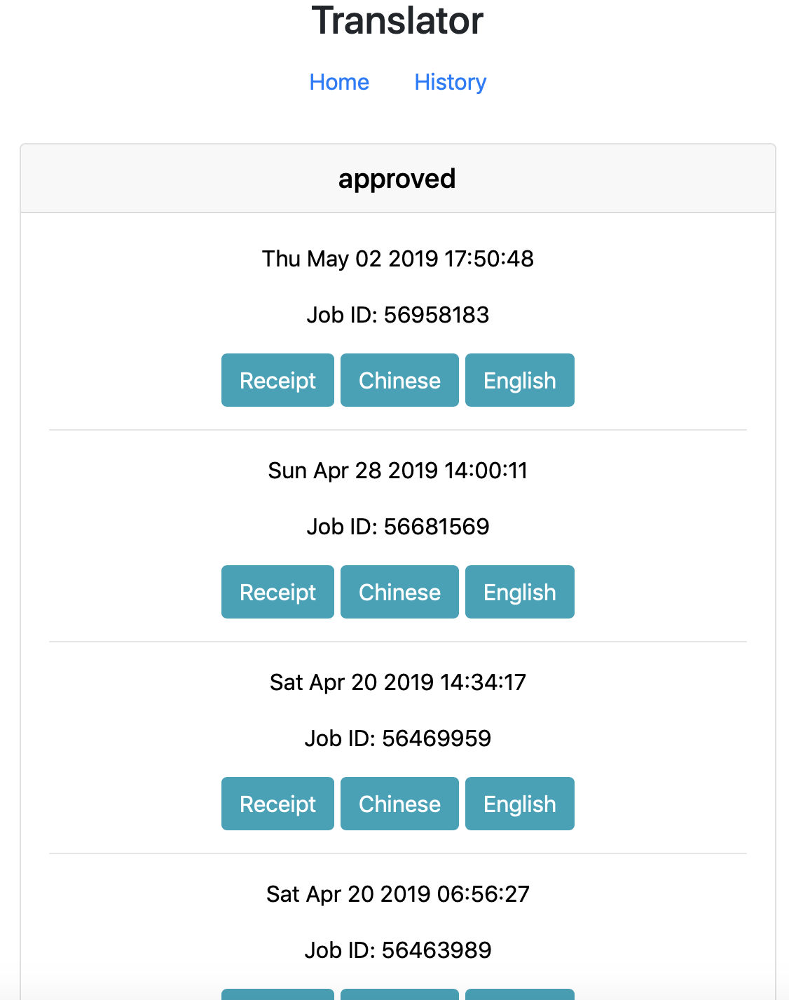

# Translator
Translator for PDIS. A web interface for gengo translate. With receipt and email notification.


# How to use: 

### Arch
'Translator' is the bot, for getting receipt and translated file.
'Translator/web' is the web UI, display the information.

ScreenShot of Web.



FIrst page for submit the content.



History Page for get the receipt and files.

 

Requirements:

```
nodejs.

npm.

pm2
```


These project has two componentes. One is at /web for web(UI service, download history file). The other one is bot(get new receipt, files, send email notificaiton by checking it every three hour).


Use bot.

```javascript
npm install 
node bot.js
## Login with Account and password
# When first time auth with google/account.
# at bot.js
const options = {
  'headless': false,  // no gui browser
  'userDataDir':"./data" // save browser data,session,cookie
};
const logined = false;
# set logined to false, will let you to login at first time. Due to gengo google auth limit.
# Remember to set headless to false. 

If you logined sucessful, change 
# at bot.js
const logined = true;
const options = {
  'headless': true,  // no gui browser
  'userDataDir':"./data" // save browser data,session,cookie
};
# set logined to true, will let you to go to the dashboard page.
# Remember to set headless to true. 

# deploy with pm2, schedule run in every 3 hour.
pm2 start   --merge-logs --log-date-format="YYYY-MM-DD HH:mm Z" --cron "0 */3 * * *" -n bot bot.js
```

Use web
```javascript
npm install

# deploy with pm2
pm2 start server.js
```


# Current Arch

Web service and Bot service at other VM at HGR.

# Config 

## example: config.json


```json
# at root folder.
# config.json
# account and password for gengo account.
# mailgunkey for mailgun service.
# targets: a array for notification email list.

{
    "account": "xxxxx@xxx",
    "password": "xxxxxx",
    "mailgunkey": "key-xxxxxxxxxxxx",
    "targets": ["xxx@gmail","xxxxxx@gmail.com"]
}
```

```json
# For Gengo Web Service.
# Gengo API key.
# web/config.json

{
    "publicKey":"xxxxxxxx",
    "privateKey":"ddd",
    "sandbox": false
}
```


